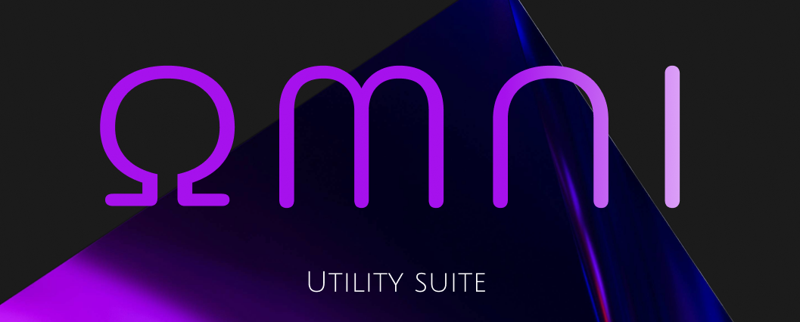

<p align="center">
  
</p>

# OMNI Multitool

A lightweight collection of desktop utilities built with **WPF and .NET**.

## Goal

OMNI is a personal desktop multitool designed to bring commonly used utilities into a single, simple application.

The project also serves as a practical exercise in rebuilding and refining my WPF development skills through hands-on implementation, UI experimentation, and reusable components.

---

## Features

### Utilities

* **Color Picker** — Pick and inspect colors using an interactive color picker.
* **Image Converter** — Convert images between common formats.
* **Unit Converter** — Convert between different units of measurement.
* **Water Reminder** — Receive periodic reminders to stay hydrated.

Additional utilities are planned for future versions.

---

## Tech Stack

* **C#**
* **.NET**
* **WPF**
* **XAML**
* **PowerShell**
* **Inno Setup**

### Libraries

* **PixiEditor ColorPicker** — Color selection and manipulation controls.


---

## Development

Clone the repository and open the solution/project in **Visual Studio**.

Build and run the project normally through Visual Studio, or use the .NET CLI:

```bash
dotnet build
```

To run the application:

```bash
dotnet run
```

---

## Building the Installer

OMNI uses a PowerShell build script to automate publishing and installer creation.

The script:

1. Cleans previous build outputs.
2. Publishes the application for `win-x64`.
3. Verifies the published executable.
4. Locates Inno Setup.
5. Compiles the installer.
6. Copies the resulting installer into the `dist/` directory.

Run:

```powershell
.\build-installer.ps1
```

A specific version can also be supplied:

```powershell
.\build-installer.ps1 -Version "0.1.1"
```

The resulting installer will be placed in:

```text
dist/
```

---

## Screenshots

### Main Window

<!-- Add screenshot here -->

### Color Picker

<!-- Add screenshot here -->

### Water Reminder

<!-- Add screenshot here -->

---

## Version

Current version:

**v0.1.0**

OMNI is currently under active development. Features and UI may change between releases.

---

## License

This project is currently intended as a personal project.
